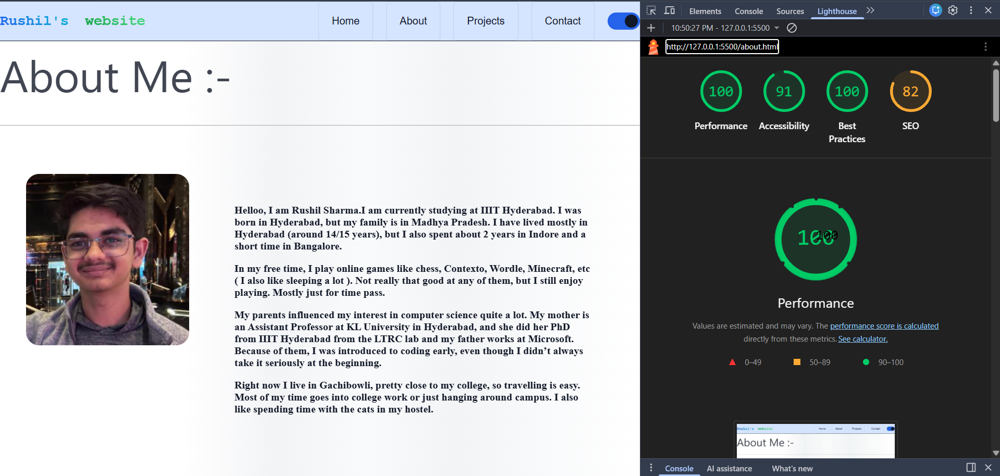
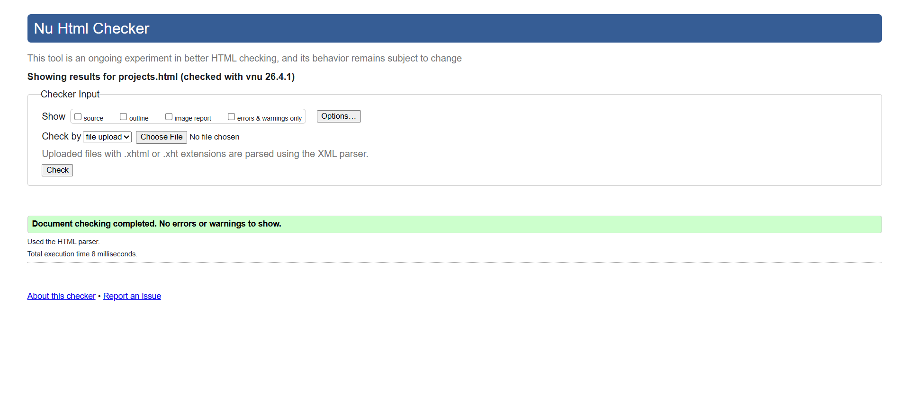
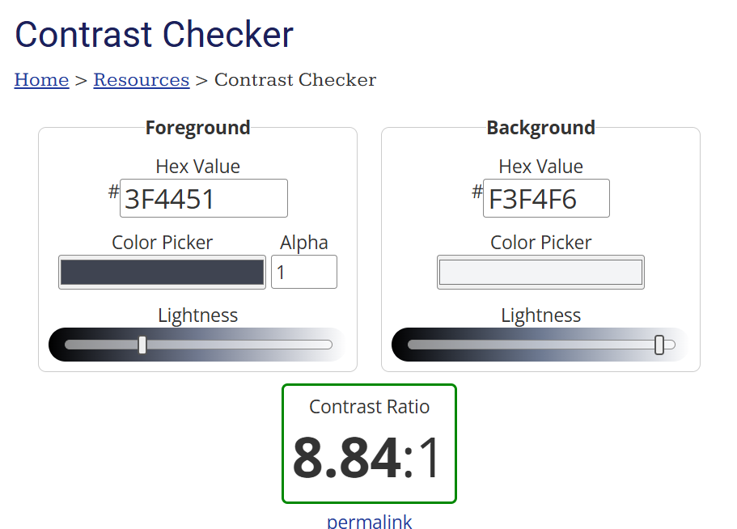
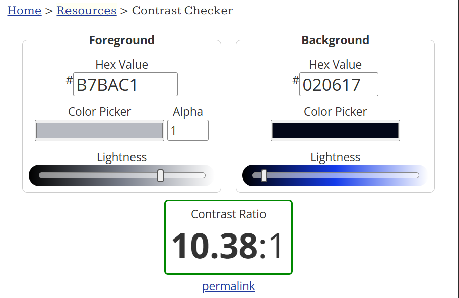

# Rushil's Website 2025114009 ISS ASSIGNMENT 2

Live url : https://researchweb.iiit.ac.in/~rushil.sharma/index.html

## My Design Choices 
### The Themes
My website makes the normal theme as dark with a shade of dark blue and gray. The background also uses this as a gradient. 
There is an alternative light theme which is a mixture of white and light blue.
Basically the whole theme I am trying to go with is a very minimalistic and smooth Website.  
### Dark Theme
As i mentioned, darker shades of blue and in some parts grey are used to, nor be too distracting neither be too plain.
### Light Theme
Similarly for Light I tried to keep the theme a little more solid and also made the hover colours a little bit softer.
### Font Choices

Gill Sans (Body Font)
Courier New (Display Font)
System UI Font Stack
These fonts are the fonts I used which match the minimilistic theme that I am going for. Also this helps in the page loading faster.
This font is also the one that is used generally thus making it easier to read also.

## Easing Curve
### Cubic-Bezier
I have used in all of my nav hover transitions this line 
> transition: all 0.5s cubic-bezier(0.4, 0, 0.2, 1);

This code basically helps make my animation look smoother as it first is slow then speeds up and then ends slow. This all happens very fast but it gives the animation of transition a very nice floating effect.
This is done fast to not make it pop out much but still be there internally.
The animation is trying to communicate a hovering (wanting to be pressed) transition but very subtly. Not showing too much eagerness.
## D-4
### Group A
I have chosed A-1

I have added tags to my projects and made a filter by tags and clear tags option.
### Group B
I have chosen B-2

In the timeline I built, I have made it in a singular ul. I have also implimented that each item must collapse and increase on the active state.

## Accessability and Code Quality
I have ran the Light house audit (picture provided in pictures later on)
I have also added the ARIA usage as mentioned in the D-5 and made sure other things like tab order and outline is not disturbed.

## Checks 

